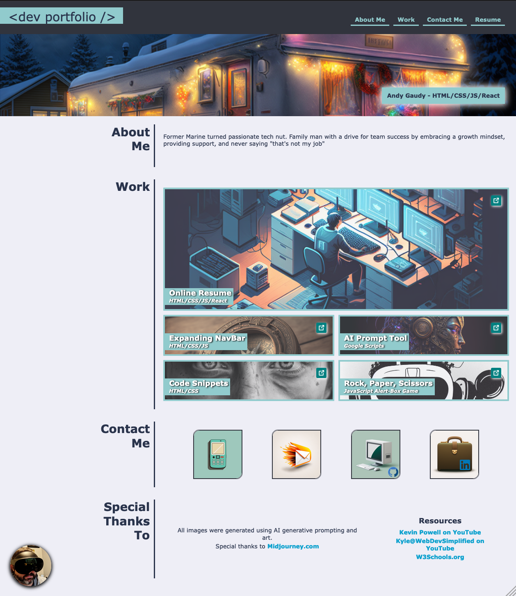

# Dev Portfolio
## Description

This project was assigned at the end of Week 1 - assignment details can be located in Assignment.md.  This will serve as a repository of links and resources showcasing my learnings and progression as a full-stack developer.  It's built to be responsive down to 350 pixels and at all large formats.  All images and icons were generated by me with AI prompts using [Midjourney](https://www.midjourney.com).

## Table of Contents

- [Installation](#installation)
- [Usage](#usage)
- [Credits](#credits)
- [License](#license)

## Installation

Runs in the browser for mobile, tablet, laptop, and PC devices.

## Usage

You can visit the live application at - https://maximusdecimalusmeridius.github.io/dev-portfolio/

## Credits

 All site images were prompted by me and created by [Midjourney](https://www.midjourney.com).

## License

MIT License - Please refer to the LICENSE in the repo.